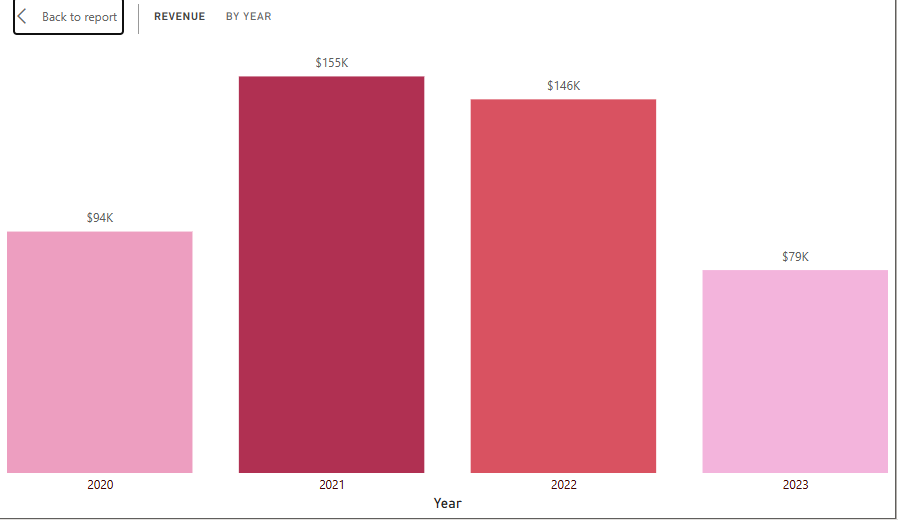
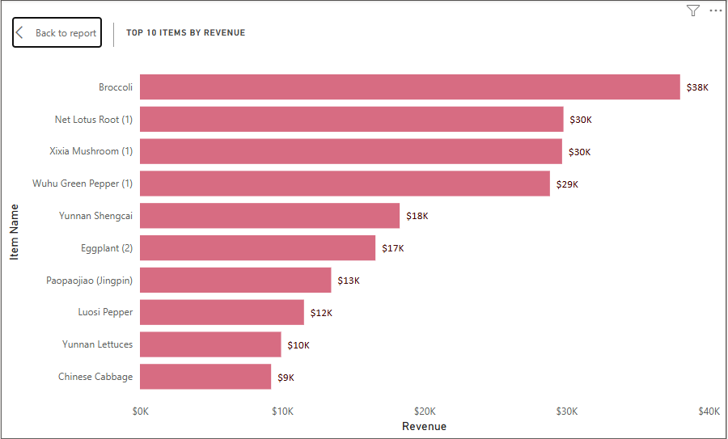

# Farmers-Superstore - Guangzhou, China

## Project Overview 

Farmers Superstore is a mid-sized retail chain specializing in fresh produce and perishable goods, operating across several urban districts in southern China since 2019. Over the last 3 years, from 2020, Farmers Superstore has grown to serve over 50,000 monthly customers, and expanded its vegetable category portfolio from just two to 6, that is, tuberous vegetables, Cabbage, Edible Mushrooms, Flower/Leaf Vegetables, Capsicum, and Solanum, each containing a variety of fresh vegetables to cater to the diverse customer demographics. 
This analysis covers the period 2020–2023, focusing on product analysis to uncover patterns driving profitability, loss inefficiencies, and sales performance across product categories, to support management’s push for data-backed decision-making. The analysis was grounded on the following metrics

### Project Objective

My task as the Data Analyst was to perform a comprehensive analysis of sales, profitability, pricing, and product loss across all categories to:
1. Identify performance trends over time,
2. Uncover the financial impact of product loss,
3. Evaluate the effectiveness of discount strategies, and
4. Recommend actionable steps for improving profitability.

The supermarket industry is highly competitive, operating on low margins and high inventory turnover; hence, profitability depends on optimal pricing, inventory control, and loss prevention, especially for perishable goods.
Insights and Recommendations Are Provided on the Following Key Areas
1. Category 1: Sales Performance & Profitability
2. Category 2: Inventory & Loss Management
3. Category 3: Pricing & Discount Strategy
4. Category 4: Wholesale Pricing & Category Mix

Targeted SQL queries regarding various business questions can be found here [link].

An interactive Power BI dashboard used to report and explore sales trends can be found here [link].

### Data Structure & Initial Checks

**Initial Data Quality Checks**

Prior to analysis, the following validation steps were performed using SQL
- Checked for duplicate item codes across tables (none found).
- Verified that all sales and cost entries matched valid ItemCode values.
- Confirmed consistent date formats (YYYY-MM-DD).
- Removed null or zero-value records in pricing and quantity fields.
- Standardized naming conventions and units across all tables.
  
The Store’s dataset contained 4 tables: Items, Sales, Wholesale cost price, and Loss rate. These tables were extracted from the supermarket’s operational database and represent product-level, transactional, and cost-related data across the years 2020–2023.

1. **Items**. Contains a master list of all products sold by the supermarket, with 251 rows. The columns it contains are item code, item name, category code, and category name. 
2. **Loss Rate**. Contains 251 rows and records item-level product losses. The table contains Item Code, the unique code of vegetable products, Item Name, which contains the vegetable names, and the loss rate in % for every vegetable product. This table was important in calculating the financial loss rate per category.
3. **Sales**. This table contains a total of 878,503 transaction sales logs. The table columns are sales data that shows the time, day and date customer made the sale, Item code that references the vegetable product bought, quantity sold that shows how much Kilograms were bought, Price in $, sale status if the transaction was a complete sale or ended up as a return, and the Discount Status which indicates if the vegetable product purchase was discounted or not. This is the largest table used for trend, revenue, and profitability analysis. 
4. **Wholesale**. This table tracks procurement costs for each item over time, reflecting supplier price changes and their effect on margins.	The table contains 55,982 rows, with columns: Date that reflects the day, month, and year the stock was bought, item code that records the vegetable items bought, and the wholesale price that shows the wholesale price they were bought.

### ERD Diagram

## Executive Summary

Between 2020 and 2023, Farmers Superstore achieved a total revenue of $474K and a net profit of $160K, representing a healthy 34% profit margin. 
An average loss rate of 9.43% from the vegetables indicates significant value leakage from product spoilage and inefficiencies in stock handling. 
2021 was the best performing revenue year with $155K, mostly contributed by high retail prices responding to suppliers’ high prices, while 2023 was the poorest performing year with only $79K revenue due to rise high-rising of prices that triggered quantity demanded to drop significantly. Sales revenue trend decreases over time overall.
Cabbage, aquatic tuberous vegetables, and Solanium categories have higher loss rates than sales revenue; 14%, 12% and 7% respectively.
Flowers/leafy vegetables are leading in demand due to relatively lower prices, while Solanum is the lowest vegetable category demanded, with a relatively high retail price. 
Best-selling categories in revenue and with lower loss rates are flower/leafy vegetables, capsicum, and edible mushrooms. Capsicum and flower/leafy vegetables are the most significant contributors over time in revenue from 2021 to 2023
Broccoli, Lotus Root, and Xixia Mushroom are the top-performing items, driving a large portion of total revenue.
Capsicum wholesale prices are high, but it is relatively less in demand by people.
Discounts are not actively impacting sales, as non-discounted products sell more than discounted products.  

### Key Performance Snapshot (2020–2023)

- **Total Revenue**: $474K. Driven by strong sales in fresh produce categories
- **Total Profit**: $160K. Represents a 34% overall profit margin
- **Average Loss Rate**: 9.43%. Indicates operational inefficiencies in stock management
- **Top-Performing Items**: Broccoli, Lotus Root, Xixia Mushroom,	Consistent revenue drivers
- **Highest Procurement Cost Categories** are Capsicum, Flower/Leaf Vegetables, but perfom well in slaes revenue. 

### Visualize the dashboard here. 

## Insights Deep Dive

### Category 1: Sales Performance & Profitability

**Steady Decline in Revenue Over Time**

- Between 2020 and 2023, Farmers Superstore’s total revenue reached $474K, but the sales trend showed a steady decline over time.
- 2021 was the best-performing year, generating $155K in revenue, largely driven by higher retail prices that matched supplier cost increases. However, quantity sold was low and kept dropping till late 2022
- However, by 2023, revenue dropped sharply to $79K. 2022 experienced a reduced trend of wholesale prices, which triggered retail prices to lower and quantity demanded to increase. However, in 2023, wholesale prices shot up, triggering retail prices to shoot up, but not high enough, hence quantity sold continues to rise due to lower prices. However, the store was spending increased wholesale costs due to the spike in prices.

  
**Profit Margin Remains Healthy at 34%**
  
- Farmers SuperStore maintained a 34% average profit margin, signaling efficient cost management in certain categories. However, there is a dependency of revenue on the top 5 categories that contribute over 40% of total profits,
  
**Category Leaders Drive Overall Sales**
  
- The Flower/Leafy Vegetables, Capsicum, and Edible Mushrooms categories dominated both revenue and sales volume from 2021–2023, indicating consistent customer preference for these affordable, fast-moving vegetables.
  
**Item-Level Best Sellers**

- Sales item leads include Broccoli at $38K, Lotus Root at $30K, and Xixia Mushroom at $30k emerged, which also doubles as a reliable margin contributor.

📈***Top 10 Best Selling Vegetables***
  
  

### Category 2: Inventory & Loss Rate Analysis

**Loss Rate Averages 9.43% Overall**

- The average loss rate of 9.43%, which translates to a significant $15K+ was lost through spoilage, expiry, or handling inefficiencies, causing a substantial erosion of profit.
  
**High Loss Categories Identified**
  
Certain product categories recorded loss rates exceeding their sales growth:

a)	Cabbage: 14% loss rate
b)	Aquatic Tuberous Vegetables: 12% loss rate
c)	Solanum: 7% loss rate

***Categories in terms of their reveneu and levels of Loss rate***

These figures suggest inefficient inventory turnover, particularly in short-shelf-life items. Reducing the current loss rate by just 2–3% could potentially unlock $10–15K in recoverable profit annually, based on the 2023 sales levels.

### Category 3: Pricing & Discount Effectiveness

**Retail Prices Influence Demand Strongly**

- There is a clear inverse correlation between retail price and sales volume
- As average retail prices rose between 2021–2023, quantity sold decreased significantly, confirming that customers are highly price-sensitive.

**Discounts Do Not Significantly Drive Sales**

- 95.22% sales are non-discounted, while 4.78% of sales are the ones with a discount. This suggests that current promotions lack clear targeting and may not align with customer buying behavior or timing.

**2021 Price Surge Effect**

- In the period 2020-2021, Lockdowns and restrictions disrupted transportation, labor availability, and imports, leading to a limited supply of fresh produce, which spiked retail prices and steadied them above the quantity demanded. In 2021, higher retail prices averaged a range of $1.5 to $1.9, almost at $2, temporarily boosting revenue as the market adjusted to supplier cost increases. However, as markets reopened post-pandemic in 2022- 2023 and transport resumed, supply stabilized, leading to slight price declines from pandemic peaks, explaining the rise in quantity sold in this period
- In 2023, persistent wholesale Inflation, caused by fuel prices, fertilizer shortages, kept vegetable prices to start rising, but remained lower compared to the pre-pandemic periods, while quantity sold surged. This is why 2023 performed poorly in revenue. This signaled diminishing returns on price escalation strategies.

💲 [Visualization: Retail Price vs. Quantity Sold / Discount Impact Analysis]

### Category 4: Procurement Costs & Category Mix

**Procurement Costs Concentrated in a Few Categories**

- Procurement analysis revealed that Capsicum ($14K) and Flower/Leafy Vegetables ($13K) represent the highest cost categories, due to perishability.
- Flower/leafy vegetable is the most consumed, making the product a key margin influencer.

**Price–Demand Misalignment in Capsicum**

- While Capsicum has the highest procurement cost $14, it is relatively less demanded compared to other vegetables. This mismatch suggests the need for repricing or sourcing strategy adjustments to optimize profitability.
  
📦 [Visualization: Procurement Cost per Category / Cost Trend Over Time]

## Recommendations

1.	**Optimize Pricing and Revenue Strategy**
   
Rather than reactive pricing, use predictive models to anticipate cost changes and adjust prices gradually, protecting both profit and customer loyalty.

3.	**Improve Inventory and Stock Rotation Efficiency**
   
- Establish automated stock monitoring and FIFO stock rotation for perishables to limit waste from perishable vegetables. Employ demand forecasting that factors in seasonality and loss rates to reduce overstocking and spoilage. 
- Explore long-term supplier contracts for high-cost categories to stabilize procurement prices.
Integrate cost data with sales performance to identify where margin compression is occurring due to rising supplier prices.

3.	**Redesign Discount and Consumer Engagement Strategies**
   
- Discounts alone have not effectively driven sales, partly due to customer perceptions of reduced quality and lack of product knowledge. To boost the impact of discounts, highlighting the value and freshness of the vegetables through messaging and in-store displays will make discounts more appealing.
- Resort to bundling vegetables with complementary products like sauces, grains, or spices to raise perceived usefulness.
Lastly, the store should apply targeted discounts where price sensitivity is proven, based on past purchase data.

4.	**Strengthen Supplier Relations and Cost Management**
   
- Negotiate long-term agreements and explore local supplier partnerships to reduce volatility in wholesale costs. Reliable sourcing ensures consistent pricing and product quality, supporting steady profit margins.

## Assumptions and Caveats

- The Loss Rate dataset lacked time data; analyses were aggregated at the item level.
- Currency values were standardized to USD at 1 RMB = 0.14 USD.
- Fewer than 0.5% of rows with incomplete numeric data were excluded.
- Product codes were assumed to be consistent across years; discontinued or replaced items were treated as new SKUs.

